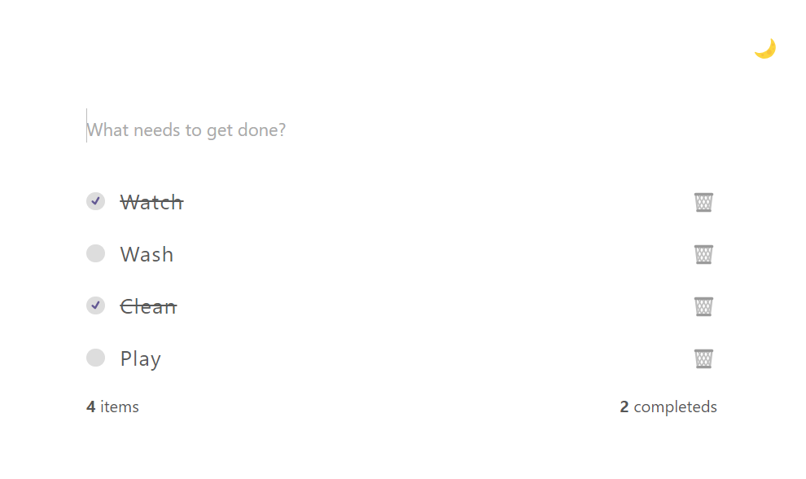

<h1 align="center">
  📸📝 Performatic TaskList
</h1>

O performatic-taskList é um mini projeto desenvolvido em React focado na otimização da performance de renderização de itens. Este projeto utiliza técnicas avançadas como virtualização de listas, memoização e carregamento assíncrono para garantir uma experiência de usuário fluida e responsiva, mesmo com grandes volumes de dados. Ideal para desenvolvedores que desejam aprender e aplicar boas práticas de performance em suas aplicações React.
<h4 align="center"><a href="https://performatic-task-list.vercel.app/">Clique para visitar o projeto</a></h4>

---

## 💼 Tecnologias utilizadas

Para o desenvolvimento deste site utilizei as seguintes tecnologias:
- React.js
- Vite
- React Hooks
---

<h2>👨‍🚀 Autor</h2>

<table>
  <tr>
    <td>
      <a href="https://github.com/manuelbento19">
         
        
          <b>Manuel Bento</b>
        
      </a>
    </td>
  </tr>
</table>
